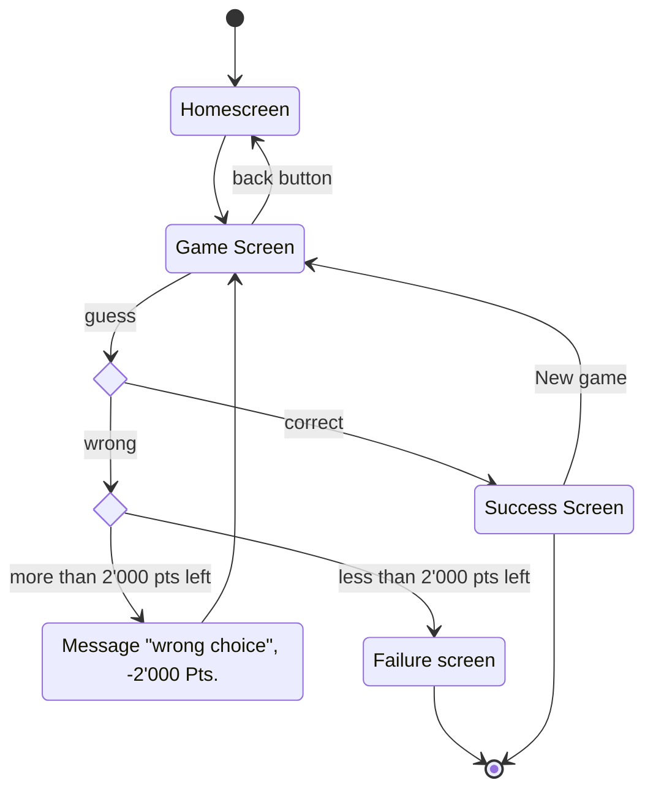

# Image Guesser / WhoAmI

## Group Members

- Csomor Elias (csomoeli)
- Tycho Frei (freityc)
- Manuel Graf (grafman2)
- Nathan Hess (hessnat1)

## Problem Hypothesis

In Situations (e.g. in a crowded train) where one cannot work or concentrate well, there should be an alternative to spend some time.

## Target Group (Customer Hypothesis)

Commuters, Uncles & Aunts

## Customer Questions

- Does a mobile game have to be playable with one hand?
- Does a mobile game have to have a persistent state?
- Do I have to have an account to play the game?
- When would you consider a mobile game to be mindless fun?
- How do the developers earn money with the App?
- On which spot on the screen are ads acceptable?

## User Stories

As a frequent commuter I find myself on cramped trains all the time. When I’m stuck on a train like this, the environment around me is loud, and I have no place to sit down and take out my laptop, so I cannot work. In this situation, I want to have some fun to take my mind off my uncomfortable situation.

As an uncle, I have a nephew that frequently asks me whether I have any games on my phone. As a good uncle I wish I could indulge him. I would like him to play a game where he must think about finding a solution to a problem, instead of just playing mindlessly.

## Game Overview

The user is given a cropping of an image. Given this the user has to find out what the image depicts. The user is then rewarded according to how fast they got to choosing the correct item. If the user chose the correct concept quickly, their score is higher than if they took more time to choose an item. There is a countdown which counts from a maximum of points to 0. If the countdown reaches 0, the current game is over and the user can start with a new image. Wrong choices are punished with a malus.

## State diagram

## Technical Feasibility

### Backend

- Image Sources (For the Prototype: Select ~100 images manually, select the cropping points manually or randomly select these points)
- Scoring System
- Scoreboard

### Frontend

- Home screen with current score and button to start a new game

  **Wireframe of the home screen**

  

- Game screen (maybe counter on top, then image below, choices on the bottom)

  **Wireframe of the game screen**

  

  **Mockup of the game screen**

  

- Feedback overlay
  - Success: Points earned, new score, button to start a new game
  
    **Wireframe of the success screen**

    

  - Fail: Try again, points lost (see wireframe above)

### Extension

In the future, AI could be used to search for interesting images, and to select interesting points. If implemented users would never see the same image twice.

### User Interaction

From the Home Screen, the user can start a new round. They will then be taken to the game screen where they can play the guessing game. They see three croppings of the big image and see a selection of concepts and their score, which is a maximum value which ticks down as time goes by. The user can either select a concept, or they can choose to get three new croppings. If they choose to get new croppings, their score is reduced by a set amount. If the user selects a concept, they are taken to the Feedback screen, where the correct answer is shown, as well as the user’s score of the current round. The user can then go back to the home screen where their score is added to their entire score.

### Effort Estimation

The effort estimation is done in T-Shirt sizes from S to XL

- Image Sources: M
- Scoring System: M
- Scoreboard: S
- Home Screen: M
- Game Screen: L
- Feedback Overlay: M
